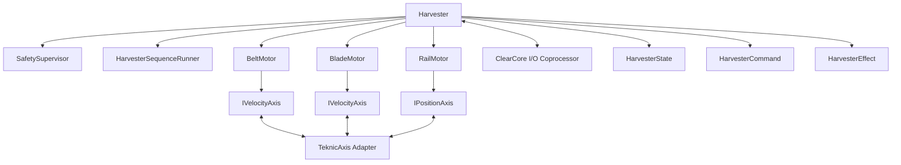

# Architecture

We want one shared architectural pattern across machines, not one shared domain model.

Both harvester and seeder should follow the same shape:

- one top-level machine runtime object
- one `SafetySupervisor`
- one machine-specific `SequenceRunner`
- typed motor wrappers over a shared axis abstraction
- plain state, command, and effect types
- thin hardware adapters around the Teknic SDK and auxiliary physical I/O

## Current direction

`Harvester` is the top-level runtime object for this machine.

It should:

- own subsystem collaborators
- accept commands
- advance runtime state on `tick()`
- apply effects through device interfaces

It should not become the place where all sequencing and safety rules live.

The Pi-hosted runtime is the machine-state authority.

It owns:

- Teknic SC motor control
- desired, applied, and observed machine state
- sequencing
- fault policy

ClearCore is not part of the motor control path. It is an auxiliary I/O coprocessor.

## Runtime skeleton

The agreed shape is one main runtime object with small collaborators below it.

```cpp
class Harvester {
public:
    Result submit(const HarvesterCommand& command);
    void tick();
    HarvesterState snapshot() const;

private:
    HarvesterState state_;

    SafetySupervisor safety_;
    HarvesterSequenceRunner sequences_;

    BeltMotor belt_;
    BladeMotor blade_;
    RailMotor rail_;

    ClearCoreClient clearcore_;
    IClock& clock_;
    ILogger& logger_;
};
```

`Harvester` is the single runtime owner of machine state.

It should coordinate work, not absorb every rule.

## Motor abstraction

Motors should share a common axis abstraction, but machine code should still read in machine language.

Use:

- shared axis interfaces such as `IAxis`, `IVelocityAxis`, and `IPositionAxis`
- thin typed wrappers such as `BeltMotor`, `BladeMotor`, and `RailMotor`

The wrappers keep the machine code readable and let each motor expose the right semantics without pushing all behavior into one giant interface.

```cpp
class IAxis {
public:
    virtual ~IAxis() = default;
    virtual Result enable() = 0;
    virtual Result disable() = 0;
    virtual Result stop() = 0;
    virtual AxisStatus status() const = 0;
};

class IVelocityAxis : public virtual IAxis {
public:
    virtual Result set_velocity_rpm(int rpm) = 0;
};

class IPositionAxis : public virtual IAxis {
public:
    virtual Result move_to_mm(double position_mm) = 0;
};
```

```cpp
class BeltMotor {
public:
    explicit BeltMotor(IVelocityAxis& axis);
    Result set_rpm(int rpm);
    Result stop();
};

class BladeMotor {
public:
    explicit BladeMotor(IVelocityAxis& axis);
    Result set_rpm(int rpm);
    Result stop();
};

class RailMotor {
public:
    explicit RailMotor(IPositionAxis& axis);
    Result move_to_mm(double mm);
    Result stop();
};
```

## Safety

`SafetySupervisor` should be its own object.

It owns:

- kill gating
- fault gating
- safety state and latching

It does not directly drive motors. It decides what is allowed and what safety effects should happen.

Heartbeat and watchdog safety may be added later without changing the main object model.

Hardware safety remains outside software.

## Sequencing

`SequenceRunner` should be machine-specific.

It owns:

- multi-step workflows
- in-flight sequence state
- step-by-step machine behavior such as pause, move, wait, and resume

For the harvester, this includes things like height changes and resume behavior.

For the seeder, the same pattern should apply, but with seeder-specific state and rules.

```cpp
class HarvesterSequenceRunner {
public:
    Result start(const HarvesterCommand& command,
                 const HarvesterState& state,
                 const SafetyState& safety);

    std::vector<HarvesterEffect> tick(const HarvesterState& state,
                                      const SafetyState& safety);

    bool busy() const;
    void cancel();
};
```

## Reuse boundary

Share:

- architecture
- interfaces
- safety pattern
- testing pattern
- runtime utilities

Do not force-sharing:

- machine state
- machine commands
- machine effects
- machine sequencing logic

The rule is: share infrastructure, keep domain behavior machine-specific.

## Preset communication

Preset input should be treated as desired machine configuration, not as confirmed motor truth.

Track separately:

- desired preset/config
- applied preset revision
- observed motor state
- safety state
- sequence state


State Retention (SC Series): If you are using the SC (Software Control) series with a PC, your software can keep track of the last known position. However, if the motor shaft is physically moved while the power is off, that position will be lost until the next homing cycle.


Use:

- a changed signal
- revisioned desired state
- latest-wins semantics

Do not rely on a bool-only `preset_changed` flag.

The runtime should work toward the newest desired revision and mark it as applied only after the sequence completes successfully.

```cpp
struct DesiredPreset {
    PresetValues values;
    uint64_t revision = 0;
};
```

## ClearCore boundary

ClearCore should stay narrow.

It owns:

- local digital input monitoring
- timing-critical output behavior such as airknife pulse sequences
- reporting local events and health back to the Pi

It does not own:

- Teknic motor control
- preset interpretation
- machine sequencing policy
- machine state authority

## Runtime model

The runtime should be single-threaded for now.

Benefits:

- simpler state ownership
- deterministic ordering
- easier testing
- easier reasoning about safety and sequence progress

Only the runtime loop should mutate `Harvester`.

If external input polling becomes blocking later, threading can be added around the input side, but `Harvester` should still remain single-writer.

The loop should stay simple:

```cpp
for (;;) {
    poll_preset_source();
    poll_clearcore_events();
    refresh_motor_observation();

    harvester.tick();

    sleep_until_next_cycle();
}
```

## File structure

```text
harvester/
  docs/
    ARCH.md
    CLEARCORE.md
    COMMUNICATION.md
    DEVPLAN.md
    INTENT.md
    OTA.md
    SETUP.md
    TESTING.md
  src/
    Harvester.h
    Harvester.cpp
    HarvesterState.h
    HarvesterCommand.h
    HarvesterEffect.h
    SafetySupervisor.h
    SafetySupervisor.cpp
    HarvesterSequenceRunner.h
    HarvesterSequenceRunner.cpp
    PresetState.h
    ports/
      IAxis.h
      IVelocityAxis.h
      IPositionAxis.h
      IClock.h
      ILogger.h
      IKillSwitch.h
      ITraySensor.h
      IAirKnife.h
      IClearCoreClient.h
    motors/
      BeltMotor.h
      BeltMotor.cpp
      BladeMotor.h
      BladeMotor.cpp
      RailMotor.h
      RailMotor.cpp
    adapters/
      teknic/
        TeknicAxis.h
        TeknicAxis.cpp
      clearcore/
        ClearCoreClient.h
        ClearCoreClient.cpp
      io/
    runtime/
      main.cpp
  tests/
    unit/
    component/
    integration/
    hardware/
    fuzz/
    fakes/
```

## Diagram


