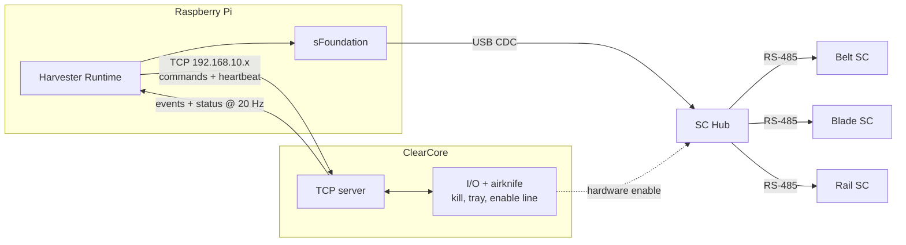

# Communication

Defines the wire protocol between the Pi runtime and the ClearCore I/O coprocessor.

Motor traffic does not flow over this link. Motors are commanded directly from the Pi over USB to the SC Hub. This link only carries I/O coprocessor traffic.

## Transport

- Single persistent TCP connection.
- Pi connects to ClearCore. ClearCore is the listening server.
- Private subnet `192.168.10.x`, fixed port.
- No TLS. No authentication. Single private link inside one machine.

Pi restarts become clean reconnects. ClearCore reboots cause the TCP socket to drop, and the next reconnect re-runs the boot handshake.

## Framing

Length-prefixed binary frames with a fixed header.

```
[ length: u16 ][ msg_type: u8 ][ payload: N bytes ][ crc16: u16 ]
```

- `msg_type` is a fixed enum shared by both sides.
- `payload` is a packed struct selected by `msg_type`.
- `crc16` covers the header and payload.

No JSON, no allocations on ClearCore. A Pi-side `protocol_dump` tool pretty-prints frames for debugging captured traffic.

## Message categories

| Category | Direction | Pattern | Examples |
|---|---|---|---|
| Command | Pi → CC | Request with seq number, ack/nack reply with same number | `set_airknife_mode`, `arm_outputs`, `disarm_outputs`, `clear_io_fault` |
| Event | CC → Pi | Push, no ack | `kill_on`, `kill_off`, `tray_detected`, `tray_cleared`, `airknife_sequence_started`, `airknife_sequence_done`, `io_fault`, `heartbeat_lost` |
| Status | CC → Pi | Push at fixed 20 Hz | snapshot from `CLEARCORE.md` plus monotonic counters |
| Heartbeat | Pi → CC | Push at fixed 20 Hz | `heartbeat_tick` |

Heartbeat in one direction and status in the other give symmetric liveness for free.

## Boot handshake

On connect, ClearCore sends one `hello` frame describing its firmware version and the set of commands and events it supports. The Pi compares against the set its release requires. See `CLEARCORE.md` for the rule.

## Heartbeat and safety enable

The Pi sends `heartbeat_tick` at 20 Hz. ClearCore drops the motor enable line and emits `heartbeat_lost` if it misses ticks for more than 150 ms. See `CLEARCORE.md`.

## Reconnect

No event replay. On reconnect:

1. ClearCore re-sends the boot handshake.
2. Pi reads the next status snapshot (within 50 ms).
3. Pi re-issues sticky configuration: `arm_outputs`, `set_airknife_mode`, etc.

To recover edge events that happened during the disconnect, the status snapshot carries monotonic counters: `tray_count`, `airknife_count`, `kill_count`, `fault_count`. Pi compares against the last counter it saw. A delta means an edge happened; Pi decides whether it cares.

## Backpressure

- Status snapshots are replaceable. If the send buffer is full, drop the older one and queue the latest.
- Events are never dropped. They are sparse (a few per second peak).
- If TCP send blocks long enough that heartbeats stop flowing, the heartbeat watchdog fires and motors drop. That is the correct response — the link is broken.

## Protocol contract

The protocol lives in a single shared C++ header:

```
shared/include/protocol/messages.h
```

It defines the `msg_type` enum, the packed payload structs, and the handshake message. Both the Pi runtime and the ClearCore firmware include it. **The header is the contract.** Versioning the header means versioning the protocol.

This implies the ClearCore build must consume a header from outside its sketch directory. The cleanest path is moving the ClearCore build off the Arduino IDE to PlatformIO. See `DEVPLAN.md` Phase 1.

## Diagram



The dashed line is the safety path: ClearCore drops the SC Hub enable line on heartbeat loss, killing motor power independent of anything the Pi is doing.
